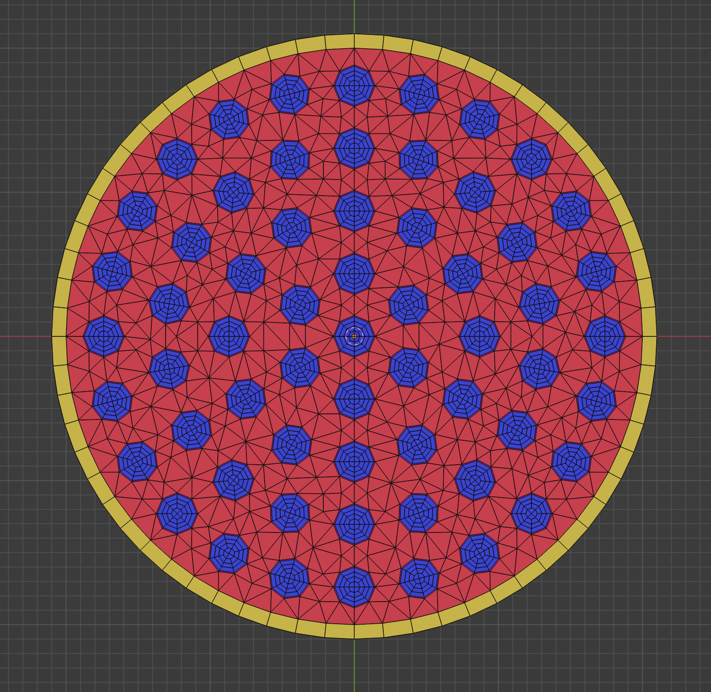
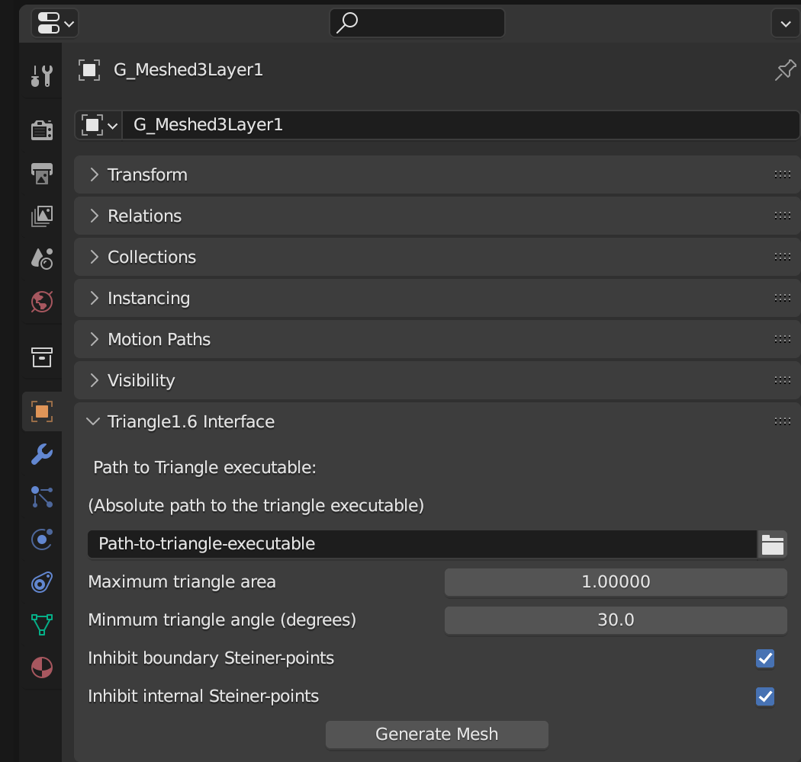
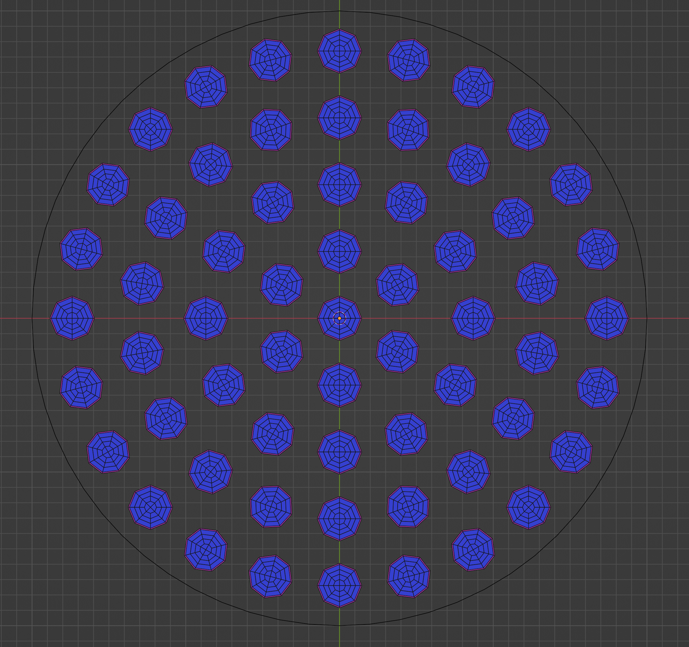
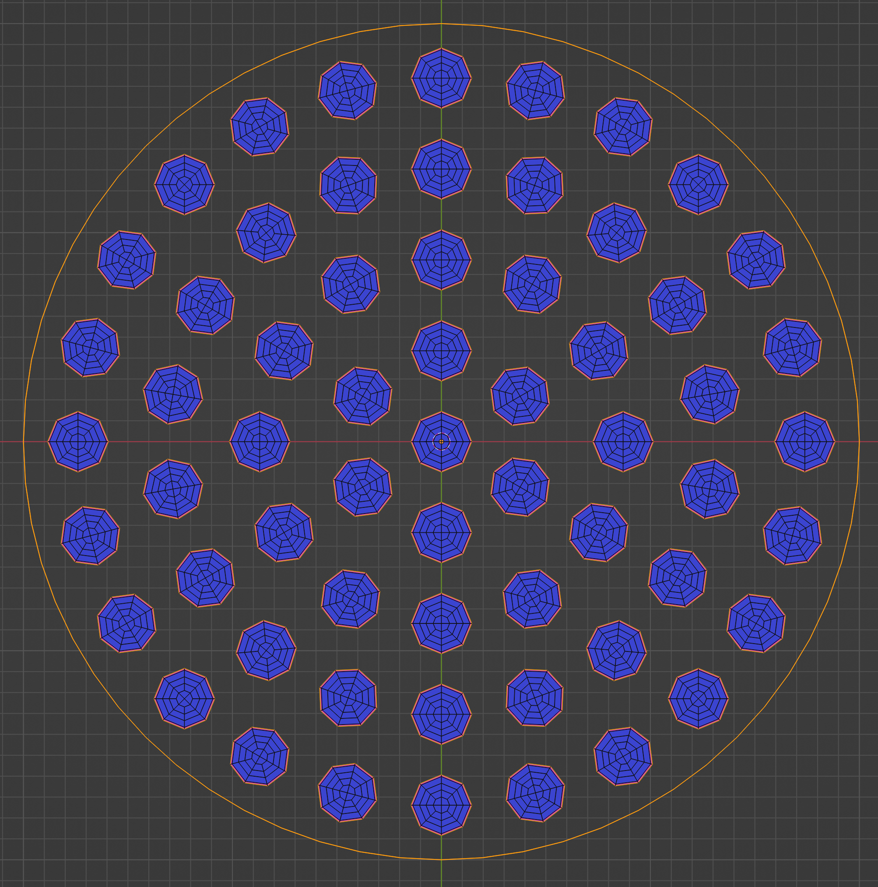
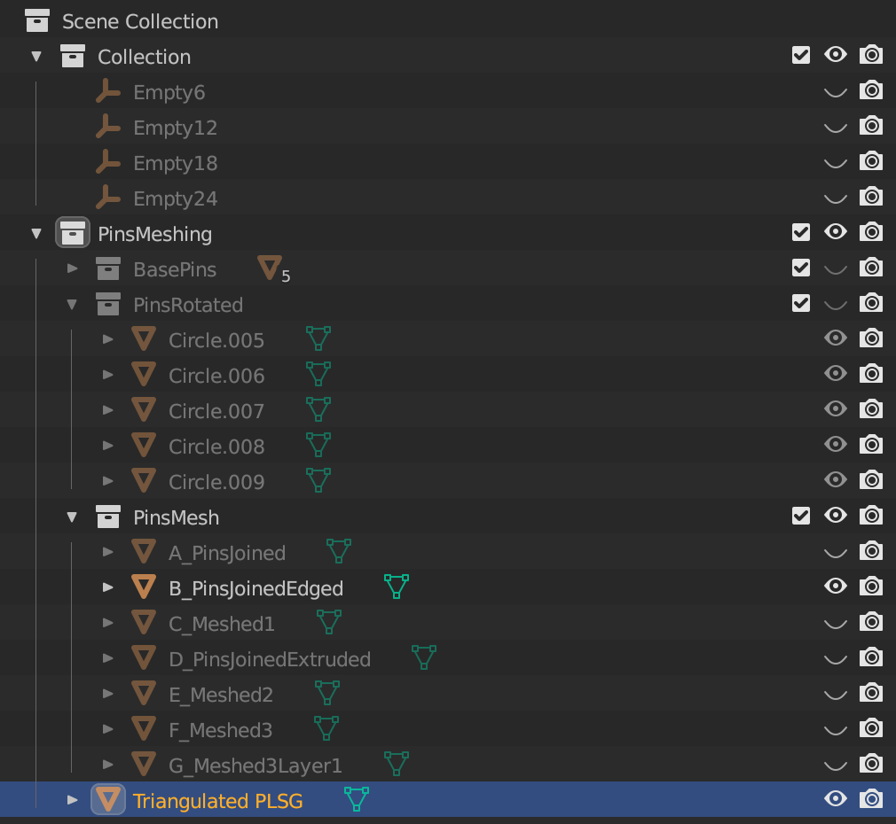
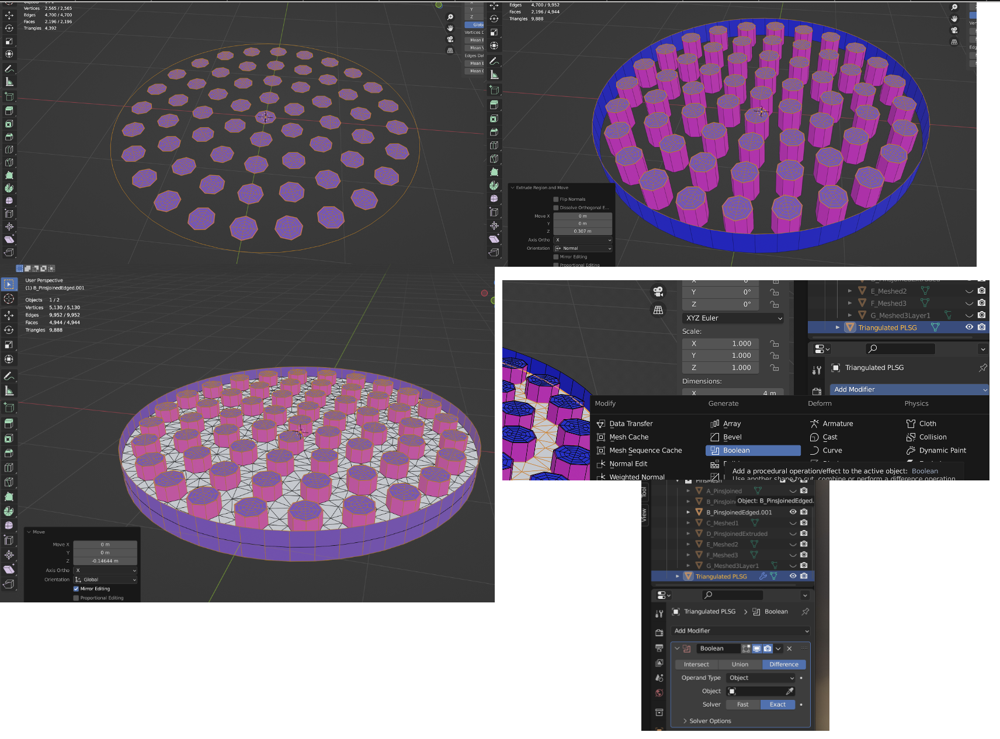
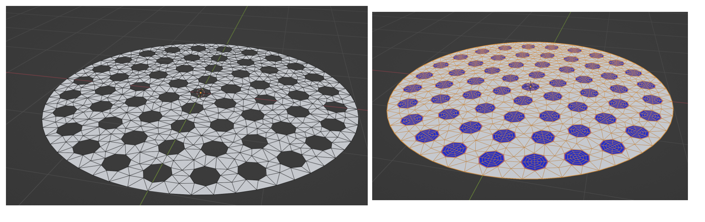
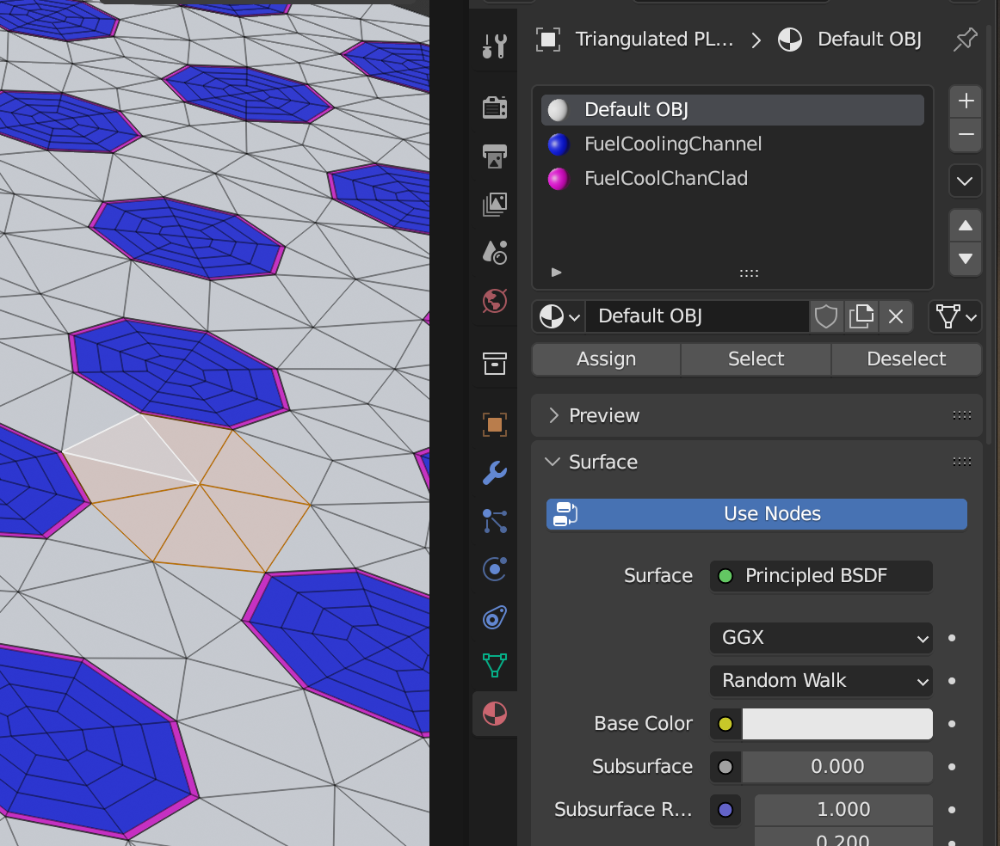
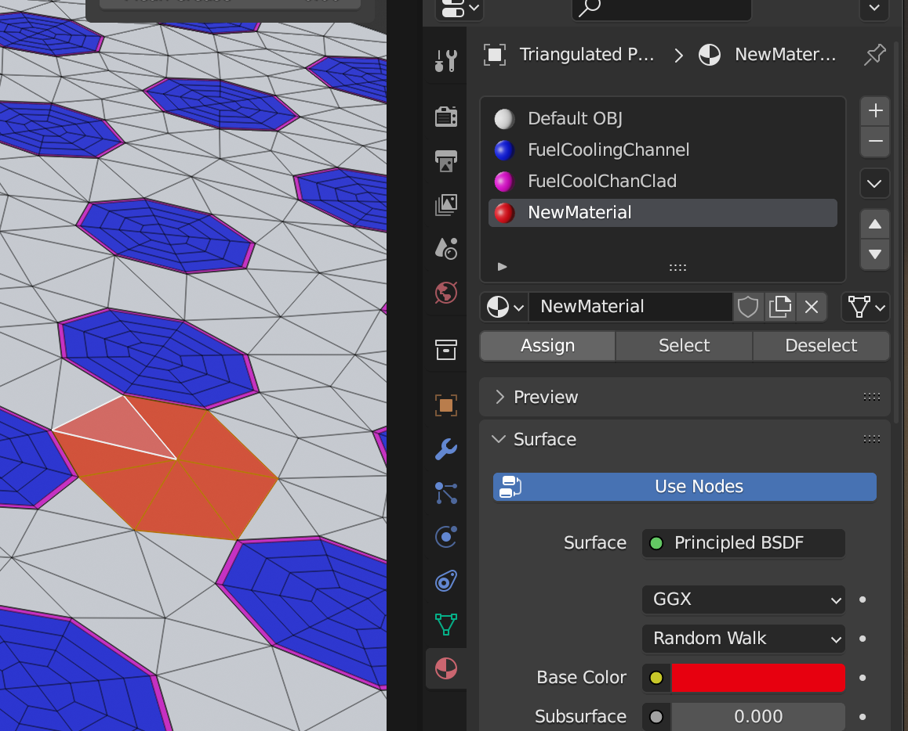

# Blender Add-On for Jonathan Richard Shewchuk's Triangle1.6
For the generation of complicated 2D meshes like these.

Using very simplified commands (shown below)

# Installation
Make `triangle1.6` from source. This can be found at 
[this repo](https://github.com/doctor-janv/triangle_v1_6).

Then ... Clone this repo to some folder. After cloning it, zip it up. Then in Blender, go to `Edit > Preferences > Add-ons` then, at the top, click `Install...`. This will open a file selector. Simply navigate to the zip file and select it. Done.

# Steps for use
## Step 1: Define something with edges
The add-on defines a Planar Straight-Line Graph (PLSG), for use by `triangle1.6`, from the selected edges of a blender object. For example,
if we want to fill in the gaps of the geometry below (which was partially manually generated) with a triangulation,

we would first need to go into `Edit Mode` and select all the `Non-manifold Edges`, as shown here

We then exit `Edit Mode`.

## Step 2: Generate the triangulation
After making sure we specified the path to the `triangle1.6` executable we then simply click the `Generate Mesh` button. 

This will create a new object named `Triangulated PLSG` which looks like this

## Step 3: Clean up and rejoin
The `triangle1.6` executable will fill any interior holes. This would interfere with the manual mesh we already had in place. To fix this we 
- first select the original mesh, and duplicate it
- go into `Edit Mode`
- select all faces
- Extrude them some distance in Z
- select all faces again (which now includes some new ones)
- Translate the geometry down slightly (press `G`, then `Z`) by moving the mouse until the extruded geometry brackets the `Triangulated PSLG`
- Go back to `Object Mode`
- Select the `Triangulated PSLG`
- Add a `Boolean` modifier
- Select the object to difference with, which will be our extruded original mesh
- Hit `Ctl+A` to apply the boolean

Screenshots of extrusion and boolean

Rejoining the original manual mesh

There are little tricks during rejoin, like merging duplicate vertices, but most things can be googled.

# How to assign materials
Materials can be assigned per face of the mesh. Practically this should be done carefully from the start so that you don't end up with a huge mesh where you have to select many individual faces.

In `Edit Mode`, select the faces to which you want to assign a material. Staying in `Edit Mode`, select the `Materials` panel

Add a new material slot. Then add a new material. Color it the way you like, then hit `Assign`. Viola!

When such a mesh gets exported to `.obj` format, the material names can be used to derive material id's.